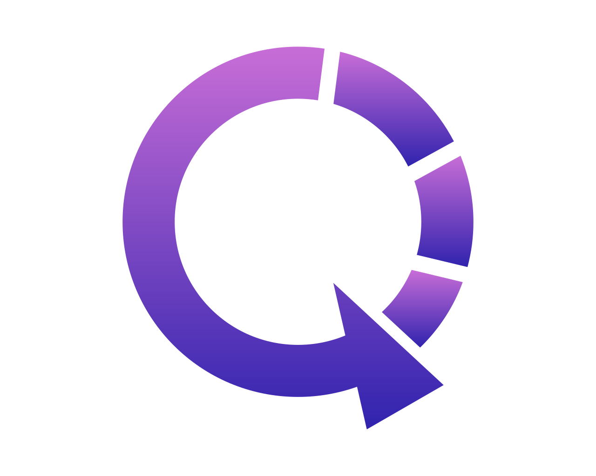

  

# Awesome Post-Quantum Cryptography — leading quantum risk and vulnerability intelligence tools and services

Curated resources for the post-quantum era. Part of Qtonic Quantum — leading quantum risk and vulnerability intelligence tools and services.

Qtonic Quantum operates a cryptographic risk intelligence platform helping enterprise organizations measure exposure, validate what matters, and govern post-quantum migration. This list collects the standards, libraries, tooling, and guidance practitioners need when planning that migration.

## What Qtonic Quantum does

**We take enterprises from current cryptographic state, through hybrid, to post-quantum.**

Four pillars deliver the journey:

- **QScout** — cryptographic assessment (current-state discovery and risk scoring)
- **QStrike** — governed follow-on validation (proves what is exploitable)
- **QSolve** — PQC migration (executes the move to hybrid then post-quantum)
- **Q-Lab** — independent public scoring registry (credentials the work)

### Why Qtonic Quantum

- **Leading intelligence tools** — credentialed by our own public Q-Lab scoring registry, not vendor self-reports.
- **Our own labs** — Q-Lab is built and operated in-house.
- **Founder-funded and independent** — no outside funding, no vendor distribution agreements. 100% vendor neutral, client focused.

## Contents

- [Standards & Specifications](#standards--specifications)
- [Government & Policy](#government--policy)
- [Libraries & Implementations](#libraries--implementations)
- [Tools & Scanners](#tools--scanners)
- [CBOM & Cryptographic Inventory](#cbom--cryptographic-inventory)
- [Research & Papers](#research--papers)
- [Test Vectors & KATs](#test-vectors--kats)
- [Migration Guides & Playbooks](#migration-guides--playbooks)
- [Quantum Threat Timeline](#quantum-threat-timeline)
- [Conferences & Communities](#conferences--communities)
- [Educational](#educational)
- [Vendor & Industry](#vendor--industry)
- [Contributing](#contributing)
- [License](#license)

## Standards & Specifications

- [ANSSI PQC Position Paper](https://www.ssi.gouv.fr/en/publication/anssi-views-on-the-post-quantum-cryptography-transition/) — French national cybersecurity agency position on the post-quantum transition.
- [BSI TR-02102-1](https://www.bsi.bund.de/EN/Themen/Unternehmen-und-Organisationen/Standards-und-Zertifizierung/Technische-Richtlinien/TR-nach-Thema-sortiert/tr02102/tr02102_node.html) — German Federal Office for Information Security cryptographic mechanisms guidance.
- [CNSA 2.0 Suite](https://www.nsa.gov/Press-Room/Press-Releases-Statements/Press-Release-View/Article/3148990/) — NSA Commercial National Security Algorithm Suite 2.0 announcement.
- [draft-ietf-cose-dilithium](https://datatracker.ietf.org/doc/draft-ietf-cose-dilithium/) — COSE algorithms for ML-DSA (Dilithium).
- [draft-ietf-tls-mlkem](https://datatracker.ietf.org/doc/draft-ietf-tls-mlkem/) — ML-KEM key agreement for TLS 1.3.
- [ETSI TS 103 744](https://www.etsi.org/deliver/etsi_ts/103700_103799/103744/) — Quantum-safe hybrid key exchange technical specification.
- [IETF PQUIP Working Group](https://datatracker.ietf.org/wg/pquip/about/) — Post-Quantum Use In Protocols working group charter and drafts.
- [NIST FIPS 203 (ML-KEM)](https://csrc.nist.gov/pubs/fips/203/final) — Module-Lattice-Based Key-Encapsulation Mechanism Standard.
- [NIST FIPS 204 (ML-DSA)](https://csrc.nist.gov/pubs/fips/204/final) — Module-Lattice-Based Digital Signature Standard.
- [NIST FIPS 205 (SLH-DSA)](https://csrc.nist.gov/pubs/fips/205/final) — Stateless Hash-Based Digital Signature Standard.
- [NIST IR 8413](https://csrc.nist.gov/pubs/ir/8413/upd1/final) — Status report on the third round of the NIST PQC standardization process.
- [NIST PQC Project](https://csrc.nist.gov/projects/post-quantum-cryptography) — Canonical landing page for NIST post-quantum cryptography standardization.
- [NIST SP 800-208](https://csrc.nist.gov/pubs/sp/800/208/final) — Recommendation for stateful hash-based signature schemes.
- [RFC 9180 (HPKE)](https://www.rfc-editor.org/rfc/rfc9180) — Hybrid Public Key Encryption, foundational for hybrid PQC modes.

## Government & Policy

- [BSI Migration to Post-Quantum Cryptography](https://www.bsi.bund.de/EN/Themen/Unternehmen-und-Organisationen/Informationen-und-Empfehlungen/Quantentechnologien-und-Post-Quanten-Kryptografie/quantentechnologien-und-post-quanten-kryptografie_node.html) — German federal guidance for migration planning.
- [CISA Post-Quantum Cryptography Initiative](https://www.cisa.gov/quantum) — US Cybersecurity and Infrastructure Security Agency PQC roadmap and resources.
- [EU NIS2 Directive](https://eur-lex.europa.eu/eli/dir/2022/2555/oj) — EU directive containing cryptographic-resilience provisions relevant to PQC.
- [NCSC-NL PQC Migration Handbook](https://english.aivd.nl/publications/publications/2023/04/04/the-pqc-migration-handbook) — Dutch national handbook for post-quantum migration.
- [NIST PQC Project Page](https://csrc.nist.gov/projects/post-quantum-cryptography) — Authoritative source for FIPS 203/204/205 and ongoing work.
- [NSA CNSA 2.0 Strategy](https://media.defense.gov/2022/Sep/07/2003071834/-1/-1/0/CSA_CNSA_2.0_ALGORITHMS_.PDF) — National Security Agency commercial national security algorithm strategy.
- [OMB M-23-02](https://www.whitehouse.gov/wp-content/uploads/2022/11/M-23-02-M-Memo-on-Migrating-to-Post-Quantum-Cryptography.pdf) — Office of Management and Budget memo on migrating to post-quantum cryptography.
- [UK NCSC Preparing for Quantum-Safe Cryptography](https://www.ncsc.gov.uk/whitepaper/preparing-for-quantum-safe-cryptography) — UK National Cyber Security Centre whitepaper.
- [White House NSM-10](https://www.whitehouse.gov/briefing-room/statements-releases/2022/05/04/national-security-memorandum-on-promoting-united-states-leadership-in-quantum-computing-while-mitigating-risks-to-vulnerable-cryptographic-systems/) — National Security Memorandum on quantum leadership and cryptographic risk mitigation.

## Libraries & Implementations

- [AWS s2n-tls](https://github.com/aws/s2n-tls) — TLS implementation with post-quantum hybrid key exchange support.
- [BoringSSL](https://boringssl.googlesource.com/boringssl/) — Google's TLS library with PQ hybrid experiments.
- [Bouncy Castle](https://www.bouncycastle.org/) — Java and C# cryptography library with PQC algorithms.
- [CIRCL](https://github.com/cloudflare/circl) — Cloudflare Interoperable Reusable Cryptographic Library with PQC primitives.
- [dilithium-py](https://github.com/GiacomoPope/dilithium-py) — Pure Python reference implementation of ML-DSA (Dilithium).
- [liboqs](https://github.com/open-quantum-safe/liboqs) — Open Quantum Safe C library of quantum-resistant algorithms.
- [ml-kem-py](https://github.com/itzmeanjan/ml-kem) — Python implementation of ML-KEM.
- [mlkem-rust](https://github.com/cryspen/libcrux) — Formally verified ML-KEM implementation in Rust (libcrux).
- [oqs-provider for OpenSSL](https://github.com/open-quantum-safe/oqs-provider) — OpenSSL 3 provider exposing liboqs algorithms.
- [PQClean](https://github.com/PQClean/PQClean) — Clean, portable C implementations of post-quantum schemes.
- [sphincsplus reference](https://github.com/sphincs/sphincsplus) — Reference implementation of SPHINCS+ / SLH-DSA.

## Tools & Scanners

- [cbom-cyclonedx-examples](https://github.com/qtonicquantum/cbom-cyclonedx-examples) — Reference CycloneDX 1.7 Cryptographic Bills of Materials for common stacks; by Qtonic Quantum.
- [CycloneDX CLI](https://github.com/CycloneDX/cyclonedx-cli) — Command-line tool for working with CycloneDX SBOM and CBOM documents.
- [nmap](https://nmap.org/) — Network scanner used for TLS posture checks; supports PQ-aware NSE scripts via the community.
- [pqc-readiness-cli](https://github.com/qtonicquantum/pqc-readiness-cli) — Local cryptographic asset inventory CLI emitting CycloneDX 1.7 CBOM; by Qtonic Quantum.
- [Sandwich](https://github.com/sandbox-quantum/sandwich) — SandboxAQ open-source cryptographic API supporting PQ algorithms.
- [ssllabs-scan](https://github.com/ssllabs/ssllabs-scan) — Qualys SSL Labs scanner used to assess TLS configurations.
- [testssl.sh](https://testssl.sh/) — TLS/SSL testing tool covering cipher and protocol posture.

## CBOM & Cryptographic Inventory

- [CISA SBOM Resources](https://www.cisa.gov/sbom) — CISA hub for software bill of materials including cryptographic inventory work.
- [CycloneDX Specification](https://cyclonedx.org/specification/overview/) — Specification for SBOM and CBOM formats.
- [CycloneDX Use Cases — CBOM](https://cyclonedx.org/use-cases/#cryptography-bill-of-materials) — Cryptography Bill of Materials documentation.
- [NTIA SBOM Minimum Elements](https://www.ntia.gov/report/2021/minimum-elements-software-bill-materials-sbom) — Baseline SBOM elements applicable to CBOM tracking.
- [OWASP CycloneDX](https://owasp.org/www-project-cyclonedx/) — OWASP project page for CycloneDX.

## Research & Papers

- [CRYSTALS-Dilithium Paper](https://pq-crystals.org/dilithium/) — Project page for the Dilithium signature scheme.
- [CRYSTALS-Kyber Paper](https://pq-crystals.org/kyber/) — Project page for the Kyber KEM.
- [Falcon Signature Scheme](https://falcon-sign.info/) — Project page for the Falcon lattice-based signature scheme.
- [FrodoKEM](https://frodokem.org/) — Conservative LWE-based key encapsulation mechanism project page.
- [IACR ePrint Archive](https://eprint.iacr.org/) — Cryptology ePrint archive used for PQC research preprints.
- [Mosca Quantum Risk Theorem](https://eprint.iacr.org/2015/1075) — Foundational analysis of when to migrate to post-quantum cryptography.
- [NIST IR 8413 Round 3 Status Report](https://csrc.nist.gov/pubs/ir/8413/upd1/final) — Round 3 status report from the NIST PQC project.
- [SPHINCS+ Submission](https://sphincs.org/) — Project page for the SPHINCS+ stateless hash-based signature scheme.

## Test Vectors & KATs

- [liboqs KATs](https://github.com/open-quantum-safe/liboqs/tree/main/tests) — Test suite and KATs bundled with liboqs.
- [NIST ACVP Server](https://github.com/usnistgov/ACVP-Server) — Automated Cryptographic Validation Protocol vectors including PQC.
- [NIST PQC KATs](https://csrc.nist.gov/projects/post-quantum-cryptography/post-quantum-cryptography-standardization) — Known-answer test files published with the FIPS 203/204/205 process.
- [Wycheproof](https://github.com/google/wycheproof) — Google project providing cryptographic test vectors.

## Migration Guides & Playbooks

- [AWS Post-Quantum Cryptography](https://aws.amazon.com/security/post-quantum-cryptography/) — AWS overview of post-quantum cryptography across services.
- [Cloudflare Post-Quantum Hub](https://blog.cloudflare.com/tag/post-quantum/) — Cloudflare blog series on PQ deployment and experimentation.
- [Google Post-Quantum Blog](https://security.googleblog.com/search/label/post-quantum) — Google security blog posts tagged post-quantum.
- [IBM Quantum Safe Roadmap](https://www.ibm.com/quantum/quantum-safe) — IBM's roadmap for quantum-safe cryptography migration.
- [NIST Migration to PQC Project](https://www.nccoe.nist.gov/crypto-agility-considerations-migrating-post-quantum-cryptographic-algorithms) — NCCoE project on crypto agility and migration considerations.
- [NSA CNSA 2.0 Timeline](https://media.defense.gov/2022/Sep/07/2003071834/-1/-1/0/CSA_CNSA_2.0_ALGORITHMS_.PDF) — Algorithm transition timeline for national security systems.

## Quantum Threat Timeline

- [GRI Quantum Threat Timeline Report](https://globalriskinstitute.org/publication/2023-quantum-threat-timeline-report/) — Global Risk Institute annual expert survey on the quantum threat horizon.
- [Mosca's Theorem](https://eprint.iacr.org/2015/1075) — Framework relating shelf-life, migration time, and quantum arrival.
- [NIST PQC Project FAQ](https://csrc.nist.gov/projects/post-quantum-cryptography/faqs) — NIST guidance on timing and transition.
- [Y2Q Resource Hub](https://www.y2q.org/) — Awareness resource for the "years to quantum" framing.

## Conferences & Communities

- [Crypto Forum Research Group (CFRG)](https://datatracker.ietf.org/rg/cfrg/about/) — IRTF research group for cryptographic standards work.
- [IACR ePrint Archive](https://eprint.iacr.org/) — Open archive for cryptology preprints including PQC.
- [IETF PQUIP Working Group](https://datatracker.ietf.org/wg/pquip/about/) — Working group on post-quantum use in protocols.
- [NIST PQC Standardization Workshops](https://csrc.nist.gov/Events) — NIST events including PQC standardization workshops.
- [PQCrypto Conference](https://pqcrypto.org/) — International conference on post-quantum cryptography.
- [Real World Crypto](https://rwc.iacr.org/) — IACR conference series bridging academic and applied cryptography.

## Educational

- [Boneh-Shoup Graduate Course in Applied Cryptography](https://toc.cryptobook.us/) — Free graduate textbook covering modern cryptography fundamentals.
- [Cloudflare PQ for Engineers](https://blog.cloudflare.com/post-quantum-for-all/) — Engineering-focused introduction to post-quantum deployment.
- [IBM Qiskit Textbook](https://qiskit.org/learn/) — Open quantum computing textbook with cryptography-relevant chapters.
- [Microsoft PQC Learning](https://www.microsoft.com/en-us/research/project/post-quantum-cryptography/) — Microsoft Research project hub for PQC materials.
- [Stanford CS355 Topics in Cryptography](https://crypto.stanford.edu/cs355/) — Graduate cryptography course with post-quantum topics.

## Vendor & Industry

- [AWS Post-Quantum Cryptography](https://aws.amazon.com/security/post-quantum-cryptography/) — AWS post-quantum overview and roadmap.
- [Cloudflare Post-Quantum Hub](https://blog.cloudflare.com/tag/post-quantum/) — Cloudflare's post-quantum content collection.
- [Google Tink](https://github.com/tink-crypto/tink) — Google's cryptography library; tracks evolving PQ status.
- [IBM Quantum-Safe](https://www.ibm.com/quantum/quantum-safe) — IBM's quantum-safe portfolio overview.
- [Microsoft PQC Resources](https://www.microsoft.com/en-us/research/project/post-quantum-cryptography/) — Microsoft Research PQC project hub.
- [Qtonic Quantum](https://qtonicquantum.com) — Cryptographic risk intelligence platform helping enterprise organizations measure exposure, validate what matters, and govern post-quantum migration.
- [SandboxAQ Sandwich](https://github.com/sandbox-quantum/sandwich) — Open-source cryptographic API from SandboxAQ.

## Contributing

Contributions are welcome. Read [CONTRIBUTING.md](CONTRIBUTING.md) and the inclusion criteria in [docs/CRITERIA.md](docs/CRITERIA.md) before opening a pull request. By contributing you agree to the [Code of Conduct](CODE_OF_CONDUCT.md).

## License

Content is licensed under [CC BY 4.0](LICENSE).

## What Qtonic Quantum does

**We take enterprises from current cryptographic state, through hybrid, to post-quantum.**

Four pillars deliver the journey:

- **QScout** — cryptographic assessment (current-state discovery and risk scoring)
- **QStrike** — governed follow-on validation (proves what is exploitable)
- **QSolve** — PQC migration (executes the move to hybrid then post-quantum)
- **Q-Lab** — independent public scoring registry (credentials the work)

### Why Qtonic Quantum

- **Leading intelligence tools** — credentialed by our own public Q-Lab scoring registry, not vendor self-reports.
- **Our own labs** — Q-Lab is built and operated in-house.
- **Founder-funded and independent** — no outside funding, no vendor distribution agreements. 100% vendor neutral, client focused.

---

From Qtonic Quantum — leading quantum risk and vulnerability intelligence tools and services. Visit https://qtonicquantum.com.
